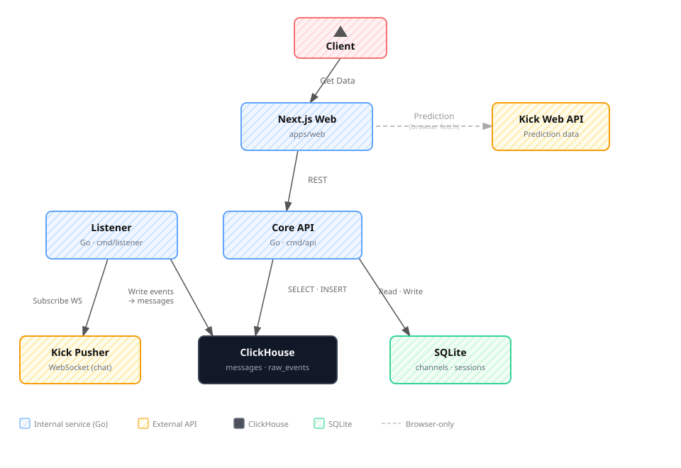

<h1 align="center">
  
  Kick Logs
</h1>

<p align="center">
  <strong>Self-hosted Kick chat logging, search, and channel analytics.</strong>
</p>

<p align="center">
  
</p>

<p align="center">
  <a href="https://github.com/YSelim0/kick-logs/stargazers">
    
  </a>
  <a href="https://github.com/YSelim0/kick-logs/actions/workflows/go-tests.yml">
    
  </a>
  <a href="https://github.com/YSelim0/kick-logs/blob/main/LICENSE">
    
  </a>
  <a href="https://buymeacoffee.com/yavuzselim">
    
  </a>
</p>

<p align="center">
  <a href="https://github.com/YSelim0/kick-logs">Repository</a>
  ·
  <a href="https://github.com/YSelim0/kick-logs/issues">Issues</a>
  ·
  <a href="https://github.com/YSelim0/kick-logs/pulls">Pull Requests</a>
  ·
  <a href="https://github.com/YSelim0/kick-logs/fork">Fork</a>
</p>

---

## About

Kick Logs is an open-source, self-hosted application for collecting public Kick chat messages from
channels you follow. It keeps a durable message history, gives you a fast web search experience, and
adds useful analytics around channels, users, emotes, replies, and activity trends.

It is designed for streamers, moderators, community managers, researchers, and anyone who wants to
own their Kick chat archive instead of depending on short-lived browser chat history.

> Kick Logs is an unofficial community project. It uses Kick web behavior and public chat events that
> can change without notice.

## How It Works

<p align="center">
  
</p>

## What You Get

- Live Kick chat logging for followed channels.
- Public search across stored messages with sender, channel, text, date, reply, and emote filters.
- Infinite-scroll message results with reply context, clickable links, and inline emotes.
- Public user and channel profile pages with activity summaries.
- Prediction pages that run client-side and do not store prediction data.
- Admin dashboard for followed channels, users, listener health, storage, and cleanup previews.
- Durable ingestion: raw events pass through NATS JetStream before ClickHouse normalization.
- Docker Compose runtime with Go, Next.js, NATS JetStream, ClickHouse, and SQLite.

## Product Shape

The app is organized around:

- **Search:** a public interface for finding old chat messages quickly.
- **Profiles and analytics:** public pages for understanding active users, channels, emotes, and
  message volume.
- **Prediction:** a public channel prediction view that fetches live Kick prediction data in the
  browser without storing it.
- **Admin:** a protected dashboard for managing followed channels and watching ingestion health.

The default stack stores high-volume chat data in ClickHouse and keeps control-plane data such as
admins, followed channels, sender profiles, retention settings, and heartbeats in SQLite.

## Contributing

Contributions are welcome. Keep pull requests focused, explain the user-facing change, and update
tests or docs when behavior changes.

```bash
git clone https://github.com/YSelim0/kick-logs.git
cd kick-logs
cp .env.example .env
docker compose up --build -d
```

Useful checks:

```bash
cd apps/api-go && go test ./... && go vet ./...
cd ../.. && pnpm format:check
```

For UI work, read `docs/design/design.md`. For backend architecture changes, read
`docs/architecture.md`.

## Self-Host It

Requirements: Docker and Docker Compose.

```bash
git clone https://github.com/YSelim0/kick-logs.git
cd kick-logs
cp .env.example .env
```

Before running it outside local development, edit `.env` and change at least:

```text
JWT_SECRET_KEY
DEFAULT_SUPER_ADMIN_EMAIL
DEFAULT_SUPER_ADMIN_PASSWORD
CLICKHOUSE_PASSWORD
```

Start everything:

```bash
docker compose up --build -d
```

Open:

```text
Web:   http://localhost:3000
Admin: http://localhost:3000/login
API:   http://localhost:8000/health
```

Default local admin:

```text
email: admin@kicklogs.local
password: admin123
```

Stop the app:

```bash
docker compose down
```

Backup and restore notes live in [`docs/operations/backup_restore.md`](./docs/operations/backup_restore.md).

Remove all stored local data:

```bash
docker compose down -v
```

## License

Kick Logs is released under the [MIT License](./LICENSE).
